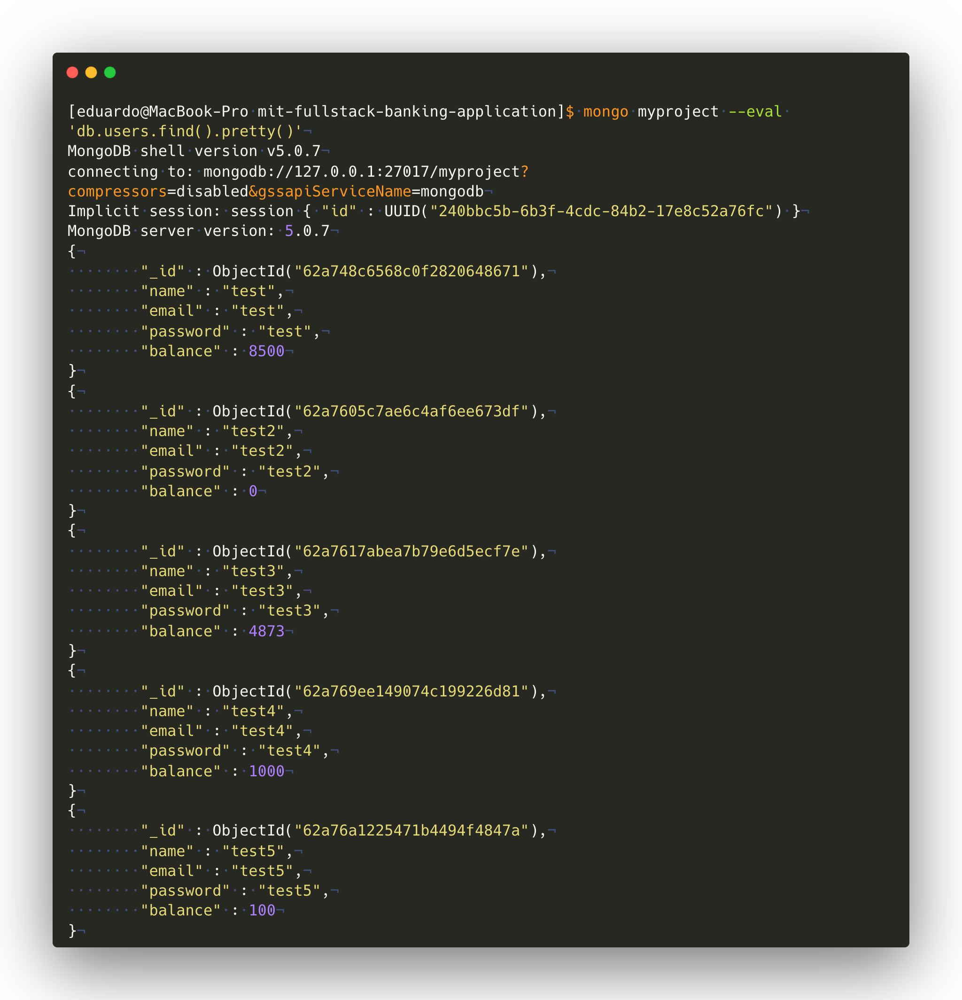

# MIT Fullstack Banking Application

## Requirements

- [x] User can create an account with an email address and password input field
- [x] User receives a success message after creating an account
- [x] After creating an account, email address or username appears in the top
    right corner
- [x] User can log in to an account with an email address/password or OAuth
- [x] User can log out of an account
- [x] User can deposit money
- [x] Total balance updates according to deposit amount
- [x] User can withdraw money
- [x] Total balance updates according to withdrawal amount
- [x] The total balance amount and any other user input persists through
    different user sessions
- [x] Logging out of the application does not reset the user data
- [x] A screenshot showing a data representation of user information and account
    balance is uploaded

## Data Representation



## Contributing

### Prerequisites

1. Install homebrew on macOS
2. Install mongodb with homebrew

    ```bash
    brew tap mongodb/brew
    brew install mongodb-community
    brew services start mongodb-community
    ## Use the following command to stop it
    #brew services stop mongodb-community
    ```

3. Install Heroku CLI with homebrew

    ```bash
    brew install heroku/brew/heroku
    ```

4. Install NVM

    ```bash
    curl -o- https://raw.githubusercontent.com/nvm-sh/nvm/v0.39.1/install.sh | bash
    ```

5. Install Node.js with NVM

    ```bash
    nvm install lts/fermium
    nvm use lts/fermium
    ```

6. Upgrade npm to npm 8

    ```bash
    npm install --global npm@8
    ```

7. Install Docker Desktop Personal

### Run

- To run locally, execute:

    ```bash
    nvm use
    npm install
    npm run dev
    ```

    Then, open [http://localhost:3000](http://localhost:3000) with your browser
    to see the result

- To run inside docker, execute:

    ```bash
    nvm use
    npm install
    npm run docker:start
    ```

    Then, open [http://localhost:3000](http://localhost:3000) with your browser
    to see the result

### Deploy

1. Create a MongoDB Atlas account (See <https://www.mongodb.com/developer/products/atlas/use-atlas-on-heroku/>)
2. Create a new project
3. Create a shared cluster
4. Create a user, make sure to take note of the password
5. Set the conection from the cloud
6. Add IP 0.0.0.0 to the permitted IPs
7. Copy the connection string for the application
8. Replace the `<password>` placeholder in the connection string and take note
    of it
9. Create your heroku app

    ```bash
    heroku login
    heroku container:login
    heroku create mit-fullstack-banking-app
    heroku config:set MONGODB_URI=<URI_FROM_STEP_8>
    heroku container:push web
    heroku container:release web
    heroku open
    heroku logs --tail
    heroku logout
    ```

### Print data representation in the terminal

```bash
mongo myproject --eval 'db.users.find().pretty()'
```

## Resources

- <https://create-react-app.dev/docs/proxying-api-requests-in-development>
- <https://stackoverflow.com/a/61927857/1714951>
- <https://reactjs.org/docs/context.html>
- <https://stackabuse.com/redirects-in-react-router/>
- <https://www.youtube.com/watch?v=_HdrLsyAdJg>
- <https://stackoverflow.com/a/14713363/1714951>
- <https://www.mongodb.com/docs/manual/tutorial/write-scripts-for-the-mongo-shell/#std-label-mongo-shell-scripting>
- <https://expressjs.com/en/starter/static-files.html>
- <https://expressjs.com/en/api.html#res.redirect>
- <https://devcenter.heroku.com/articles/container-registry-and-runtime>
- <https://www.mongodb.com/developer/products/atlas/use-atlas-on-heroku/>
